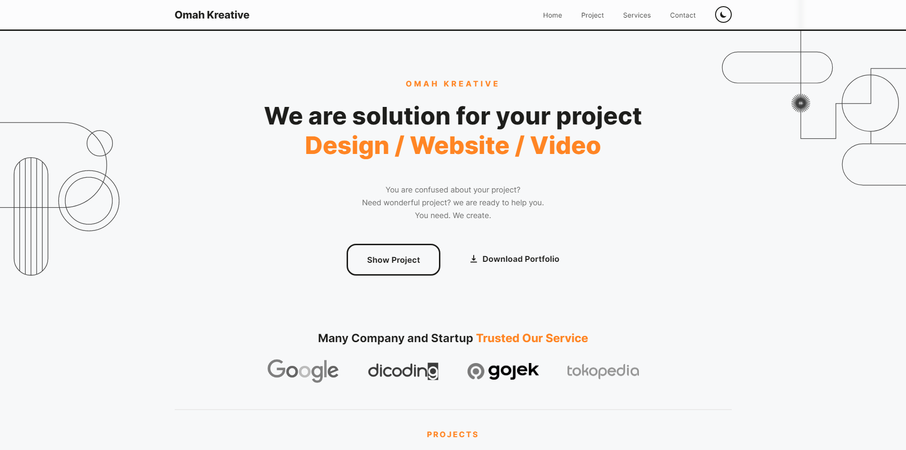

<h1 align="center">Dicoding Web Submissions (Dasar Pemrograman Web)</h1>

<a href="https://juniorimam.github.io/dicoding-web-submissions" style="text-decoration:none;">Go to Demo Page</a>

This project was created to complete the Basic Front-End Web Development Class from Dicoding.
Any project example or something is needed only for assets sample (not a real project)

## Technology Used
- HTML
- CSS
- Javascript

---

Created by [@juniorimam](https://github.com/juniorimam)
